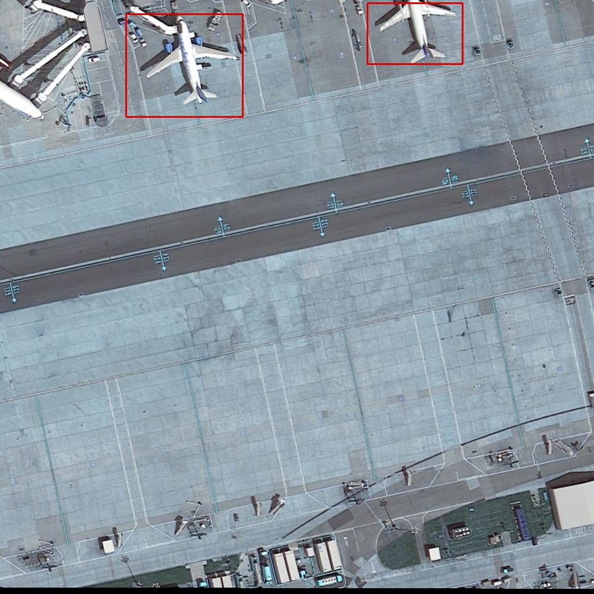
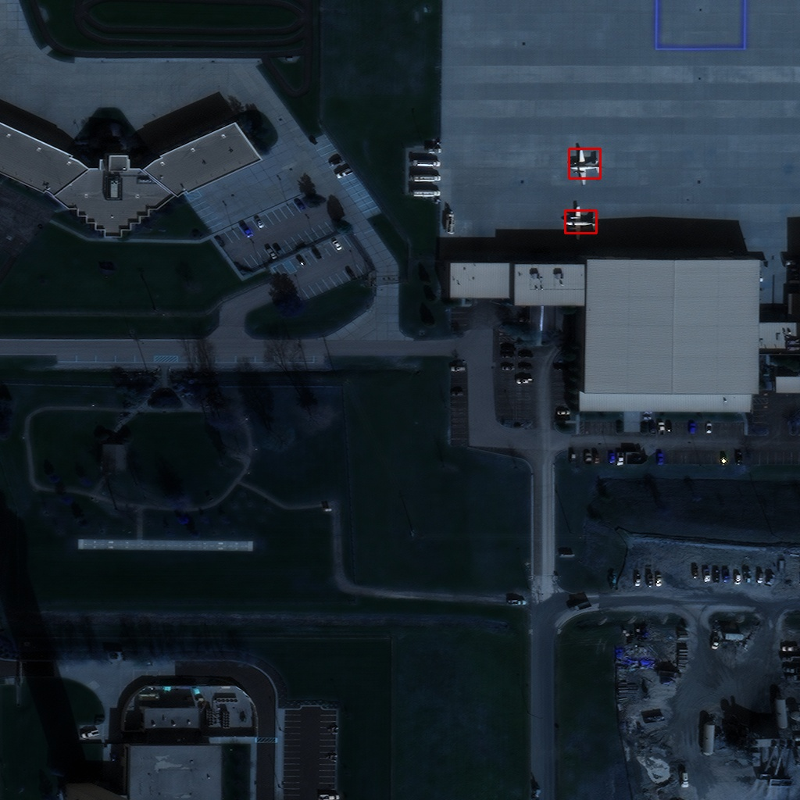

**DE⫶TR**: End-to-End Object Detection with Transformers
========
PyTorch training code and pretrained models for **DETR** (**DE**tection **TR**ansformer).
We replace the full complex hand-crafted object detection pipeline with a Transformer, and match Faster R-CNN with a ResNet-50, obtaining **42 AP** on COCO using half the computation power (FLOPs) and the same number of parameters. Inference in 50 lines of PyTorch.


**What it is**. Unlike traditional computer vision techniques, DETR approaches object detection as a direct set prediction problem. It consists of a set-based global loss, which forces unique predictions via bipartite matching, and a Transformer encoder-decoder architecture. 
Given a fixed small set of learned object queries, DETR reasons about the relations of the objects and the global image context to directly output the final set of predictions in parallel. Due to this parallel nature, DETR is very fast and efficient.
tion-with-transformers) by Nicolas Carion, Francisco Massa, Gabriel Synnaeve, Nicolas Usunier, Alexander Kirillov, and Sergey Zagoruyko.

# Usage - Object detection
There are no extra compiled components in DETR and package dependencies are minimal,
so the code is very simple to use. We provide instructions how to install dependencies via conda.
First, clone the repository locally, Then, install PyTorch 1.5+ and torchvision 0.6+:
```
conda install -c pytorch pytorch torchvision
```
## Data preparation
We expect the directory structure to be the following:
```
path/to/airplanes dataset/
  train/    # train folder
    images/
    labels/
  valid/      # val folder
    images/
    labels/
```

## Training
```
python train_airplanes.py 
```
## Evaluation
```
python predict_airplanes.py
```
## Results

 |  
:-------------------------:|:-------------------------:|
# License
DETR is released under the Apache 2.0 license. Please see the [LICENSE](LICENSE) file for more information.

